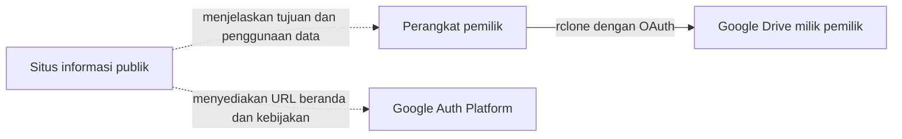

# Situs Informasi Publik OAuth Pakde Spill

Repository publik ini menjadi sumber situs GitHub Pages tingkat organisasi di [pakde-spill.github.io](https://pakde-spill.github.io/).

## Tujuan dan peran

Situs ini menjadi halaman identitas dan kebijakan publik untuk OAuth desktop client privat `Pakde Spill rclone`. Client tersebut adalah utilitas pribadi yang dipakai pemilik proyek untuk mencadangkan, memverifikasi, dan memulihkan file Pakde Spill antara workspace lokal dan Google Drive milik pemilik.

Situs publik hanya menjelaskan integrasi tersebut. Situs ini tidak menjadi perantara transfer file, tidak menerima token OAuth, dan tidak mengakses Google Drive.

## Mengapa repository ini bersifat publik

Google mewajibkan homepage dan kebijakan publik bagi aplikasi yang masuk definisi kebijakan *production app*, serta memerlukannya dalam proses verification untuk external production app. Client ini adalah unverified personal-use app, sehingga situs bukan dependency teknis rclone dan bukan bukti bahwa verification sudah selesai.

Situs tetap dipertahankan sebagai pilihan konservatif untuk transparansi, kelengkapan branding, dan kesiapan bila audience atau kebutuhan verification berubah. GitHub Pages tingkat organisasi pada GitHub Free memerlukan repository publik. Karena itu, repository ini menjadi pengecualian sempit yang disengaja dari kebijakan Pakde Spill bahwa semua repository bersifat privat secara default.

## Isi repository

| Path | URL publik | Peran |
|---|---|---|
| `index.html` | `/` | Identitas aplikasi, tujuan, dan alur data dalam bahasa sederhana |
| `privacy.html` | `/privacy.html` | Akses, penggunaan, penyimpanan, pembagian, retensi, dan kendali data pengguna Google |
| `terms.html` | `/terms.html` | Ketentuan penggunaan pribadi dan batasan layanan |
| `assets/style.css` | tidak berlaku | Tampilan bersama saja; tanpa pelacakan maupun script |
| `.nojekyll` | tidak berlaku | Menyajikan file statis tanpa proses build Jekyll |

## Batas informasi publik

Repository ini hanya boleh memuat teks kebijakan untuk publik dan aset tampilan statis. Repository ini tidak boleh memuat:

- OAuth client ID atau client secret;
- access token, refresh token, atau `rclone.conf`;
- detail Akun Google atau informasi kontak pribadi;
- source code privat, histori chat, riset, media, atau file backup Pakde Spill;
- analytics, pelacak iklan, formulir login, atau formulir pengumpulan data.

## Pemeliharaan

Gunakan Bahasa Indonesia sebagai bahasa utama untuk README, beranda, kebijakan, dan seluruh teks publik. Kode, nama file, URL, scope API, serta nama resmi produk atau kebijakan boleh mempertahankan bentuk aslinya jika diperlukan demi ketepatan.

Pastikan isi beranda, kebijakan privasi, konfigurasi branding Google Auth Platform, dan perilaku aktual rclone selalu konsisten. Perbarui kebijakan sebelum memperluas scope atau mengubah cara penggunaan data pengguna Google. Validasi semua tautan secara lokal, commit dengan pesan yang jelas, lalu push ke `main`; GitHub Pages kemudian menerbitkan situs statis tersebut.
