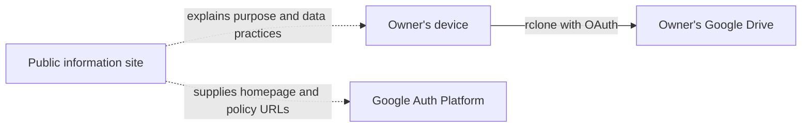

# Pakde Spill Public OAuth Information Site

This public repository hosts the organization-level GitHub Pages site at [pakde-spill.github.io](https://pakde-spill.github.io/).

## Purpose and role

The site is the public identity and policy surface for the private `Pakde Spill rclone` desktop OAuth client. The client is a personal utility used by the project owner to back up, verify, and restore Pakde Spill files between a local workspace and the owner's Google Drive.

The public site documents the integration. It does not proxy file transfers, receive OAuth tokens, or access Google Drive.

## Why this repository is public

Google OAuth production policies require a publicly accessible homepage and privacy policy. GitHub Pages on GitHub Free for organizations requires a public repository. This repository is therefore a deliberate exception to the Pakde Spill private-by-default policy.

## Contents

| Path | Public URL | Role |
|---|---|---|
| `index.html` | `/` | App identity, purpose, and plain-language data flow |
| `privacy.html` | `/privacy.html` | Google user data access, use, storage, sharing, retention, and controls |
| `terms.html` | `/terms.html` | Personal-use terms and limitations |
| `assets/style.css` | n/a | Shared presentation only; no tracking or scripts |
| `.nojekyll` | n/a | Serves the static files without a Jekyll build step |

## Public boundary

This repository may contain only public-facing policy text and static presentation assets. It must never contain:

- OAuth client IDs or client secrets;
- access tokens, refresh tokens, or `rclone.conf`;
- Google Account details or private contact information;
- Pakde Spill source code, chat history, research, media, or backup files;
- analytics, advertising trackers, login forms, or data-collection forms.

## Maintenance

Keep the homepage, privacy policy, Google Auth Platform branding, and actual rclone behavior consistent. Update the policy before expanding scopes or changing how Google user data is used. Validate all links locally, commit with a clear message, and push to `main`; GitHub Pages then publishes the static site.
